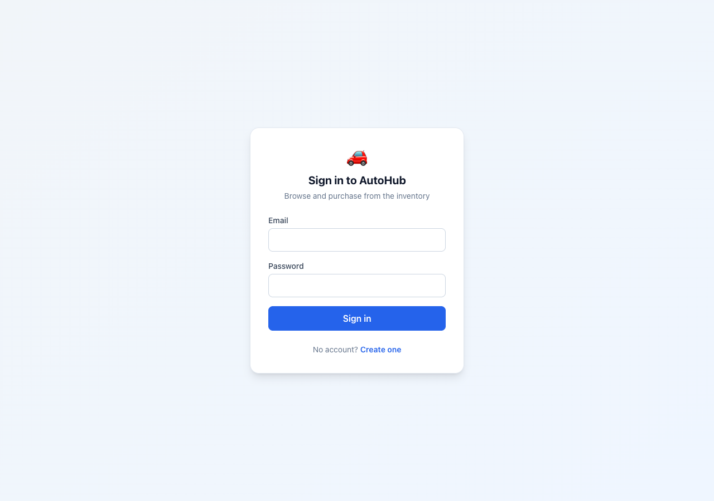
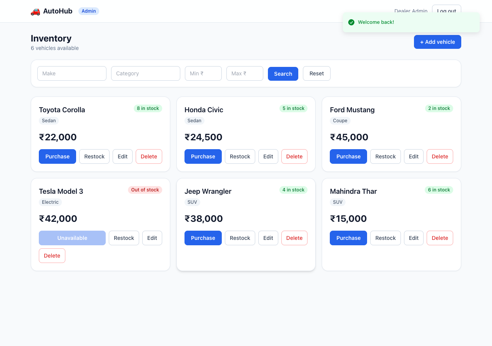
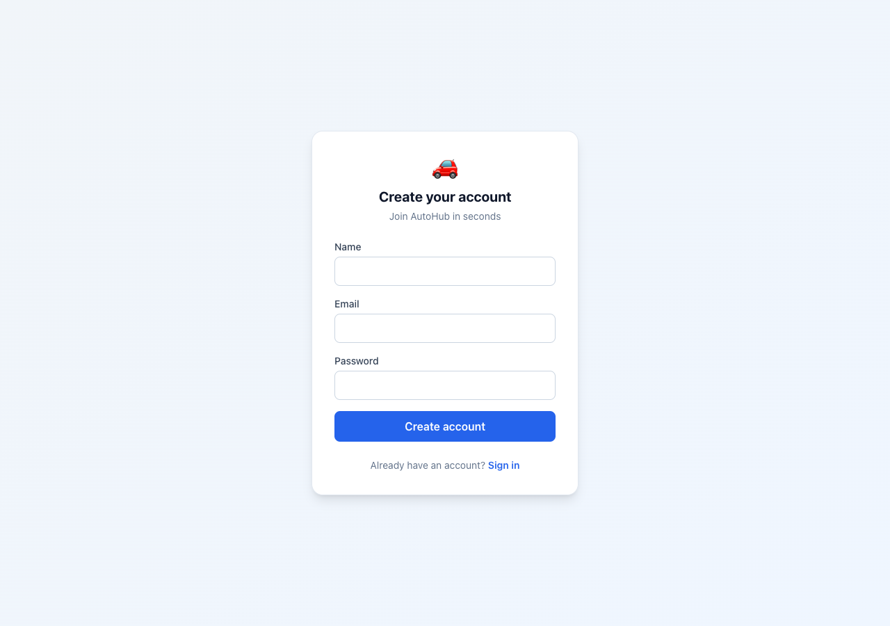
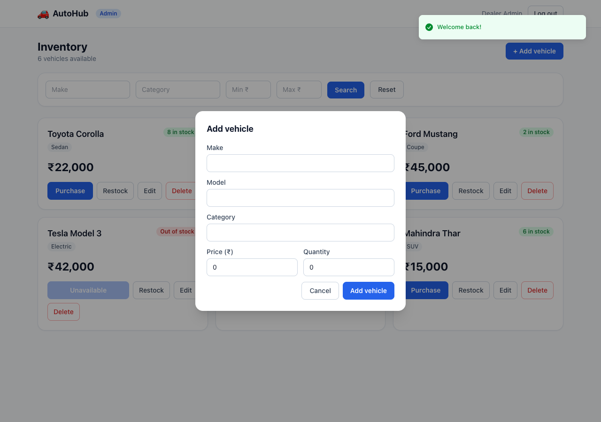

# 🚗 Car Dealership Inventory System

A full-stack, single-page application for managing a car dealership's vehicle
inventory. Users can browse and purchase vehicles; administrators can add, update,
delete, and restock inventory. Built as a Test-Driven-Development kata.

> Built with a **fixed** technology stack — Express + Prisma + PostgreSQL on the
> backend, React 19 + Vite + Tailwind on the frontend, in an npm-workspaces monorepo.

---

## ✨ Features

- **Token-based auth** — JWT access token (kept in React memory) + rotating refresh
  token (HTTP-only cookie, persisted in Postgres). Silent refresh on page load.
- **Role-based authorization** — `USER` and `ADMIN` roles; admin-only delete & restock.
- **Vehicle inventory** — list, search/filter (make, model, category, price range),
  create, update, delete.
- **Purchasing** — atomic stock decrement that can never go negative; the Purchase
  button disables at zero stock.
- **Admin tooling** — add/edit/delete vehicles and restock inventory from the UI.

---

## 🧱 Tech Stack

| Layer     | Technology |
|-----------|------------|
| Frontend  | React 19, Vite, TypeScript, Tailwind CSS, React Router, Axios, React Hook Form, Zod, Sonner |
| Backend   | Node.js, Express, TypeScript, Prisma ORM, Zod |
| Database  | PostgreSQL (via Docker) |
| Auth      | JWT (access + refresh), bcrypt |
| Testing   | Vitest, Supertest, React Testing Library |
| Tooling   | npm workspaces, ESLint, Prettier, Docker Compose |

---

## 🚀 Getting Started

### Prerequisites
- Node.js ≥ 20
- Docker + Docker Compose

### 1. Clone & install
```bash
git clone <your-repo-url>
cd car-dealership-inventory
npm install
```

### 2. Start the database
```bash
npm run db:up        # Postgres on localhost:5434 (dev + test databases)
```

### 3. Configure environment
```bash
cp server/.env.example server/.env
cp client/.env.example client/.env
```

### 4. Migrate & seed
```bash
npm run prisma:migrate -w server
npm run prisma:seed -w server        # creates the admin account
```

### 5. Run
```bash
npm run dev:server     # API on http://localhost:4000
npm run dev:client     # App on http://localhost:5173
```

### Seeded accounts
| Role  | Email                  | Password      |
|-------|------------------------|---------------|
| ADMIN | admin@dealership.test  | Admin@12345   |

---

## 🧪 Tests

```bash
npm test                 # backend + frontend
npm run test:server      # backend (Vitest + Supertest)
npm run test:client      # frontend (Vitest + RTL)
```

**Latest run: 61 tests passing** (48 backend + 13 frontend). A full breakdown is in
[`docs/test-report.md`](docs/test-report.md).

---

## 📸 Screenshots

| Login | Dashboard (Admin) |
|-------|-------------------|
|  |  |

| Register | Add Vehicle (Admin) |
|----------|---------------------|
|  |  |

> Note the **Tesla Model 3** card on the dashboard: it is out of stock, so its
> Purchase button is disabled and shown as *Unavailable*.

---

## 🤖 My AI Usage

**Tool used:** [Claude Code](https://claude.com/claude-code) (Anthropic, Opus 4.8) —
an agentic CLI pair-programmer — for the entire build. The complete, ordered prompt
log lives in [`PROMPTS.md`](PROMPTS.md).

**How I used it:**
- **Planning.** Before any code, I had it interrogate the spec for the traps a naive
  build misses — the "search must be routed before `/:id`" gotcha, the fact that
  registration has no path to `ADMIN` (hence the seed script), and that a memory-only
  access token *requires* a silent-refresh-on-load or every reload logs you out. We
  settled the open decisions (standalone repo, dockerized dev + test DB, seed admin)
  before writing a line.
- **Strict TDD.** For every unit of business logic I had it write the failing
  Supertest/RTL spec first, commit it as a **red** commit, then implement to **green**
  in a separate commit — so the git history *is* the TDD evidence. The concurrency
  test for "never oversell" (10 simultaneous purchases against 5 units) was written
  before the atomic `updateMany` that satisfies it.
- **Boilerplate & wiring.** Express middleware, the Prisma schema, the Axios
  refresh-and-retry interceptor, and the Tailwind components were AI-drafted, then
  reviewed and adjusted (e.g. narrowing the JWT `expiresIn` typing, moving the test
  schema-push into a one-time `globalSetup` when the suite got slow).
- **Verification.** It drove a real headless-Chrome session to log in and screenshot
  the app, and ran the full stack end-to-end through the Vite proxy to confirm the
  cookie/refresh flow.

**Reflection.** AI made the *scaffolding* and *cross-cutting plumbing* dramatically
faster, which freed attention for the parts that actually matter — the atomic
inventory logic, refresh-token rotation, and fail-closed authorization. The biggest
value wasn't code generation but the up-front adversarial review of the spec: catching
the admin-provisioning gap and the route-ordering trap *before* they became bugs. I
kept ownership by reviewing every diff, insisting on red-before-green, and verifying
behavior against a running app rather than trusting green tests alone.

> **Note on commit trailers:** per the repo owner's instruction, commits use plain
> messages without `Co-Authored-By` trailers; AI transparency is provided here and in
> `PROMPTS.md` instead.

---

## 📂 Project Structure

```
car-dealership-inventory/
├── client/           # React 19 SPA (Vite + Tailwind)
├── server/           # Express + Prisma REST API
├── docs/             # architecture notes, ERD, test report, screenshots
├── postman/          # Postman collection + environment
├── docker-compose.yml
└── package.json      # npm workspaces root
```

---

## 📜 API Endpoints

| Method | Endpoint                        | Auth   | Description |
|--------|---------------------------------|--------|-------------|
| POST   | `/api/auth/register`            | –      | Register (email, name, password) |
| POST   | `/api/auth/login`               | –      | Login → access token + refresh cookie |
| POST   | `/api/auth/refresh`             | cookie | Rotate refresh token, new access token |
| POST   | `/api/auth/logout`              | cookie | Revoke refresh token |
| GET    | `/api/vehicles`                 | user   | List all vehicles |
| GET    | `/api/vehicles/search`          | user   | Search by make/model/category/price |
| POST   | `/api/vehicles`                 | user   | Add a vehicle |
| PUT    | `/api/vehicles/:id`             | user   | Update a vehicle |
| DELETE | `/api/vehicles/:id`             | admin  | Delete a vehicle |
| POST   | `/api/vehicles/:id/purchase`    | user   | Purchase (decrement stock) |
| POST   | `/api/vehicles/:id/restock`     | admin  | Restock (increment stock) |
