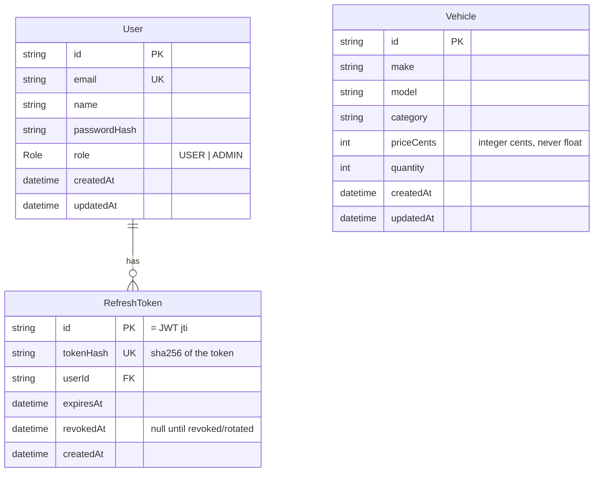

# Entity-Relationship Diagram

## Notes

- **`User.role`** is a Postgres enum (`Role`). Only the seed script creates an
  `ADMIN`; the register endpoint always writes `USER`.
- **`RefreshToken`** persists refresh tokens server-side so they can be revoked
  (logout) and rotated (each refresh revokes the used row and inserts a new one).
  Only the SHA-256 hash is stored, so a database leak cannot be replayed.
- **`Vehicle.priceCents`** stores money as an integer number of cents — the UI works
  in rupees and converts at the boundary. No floating-point money anywhere.
- **`Vehicle` indexes** on `make`, `model`, `category` back the search endpoint.
